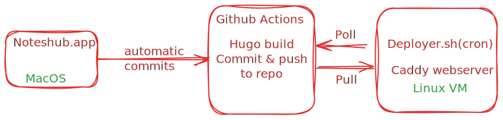
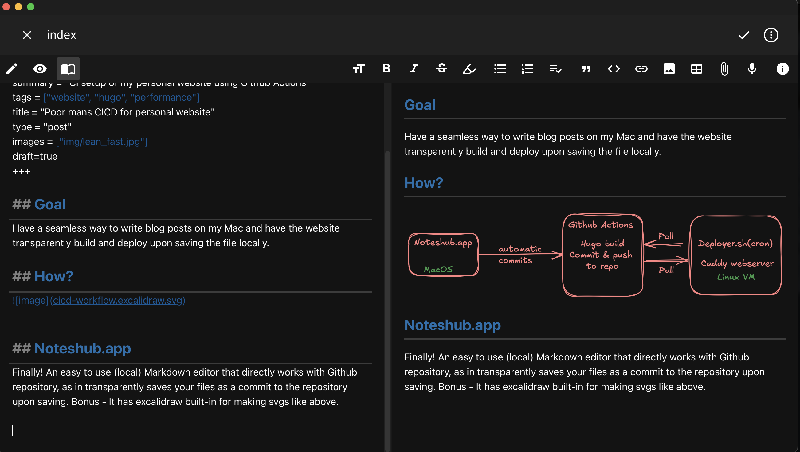

+++
author = "Aravindh Sampathkumar"
categories = ["Computers"]
date = 2024-10-14T12:00:00Z
summary = "CI setup of my personal website using Github Actions"
tags = ["website", "hugo", "cicd"]
title = "Poor mans CICD for personal website"
type = "post"
images = ["img/cicd.jpg"]
+++

## Goal
Have a seamless way to write blog posts on my Mac and have the website transparently build and deploy upon saving the file locally. This means that whenever I make changes to my website's code, the updates are automatically deployed to production without any manual intervention.

## How?



## Noteshub.app

Finally!
An easy to use (local) Markdown editor that directly works with Github repository, as in transparently saves your files as a commit to the repository upon saving. Bonus - It has excalidraw built-in for making scgs like above.

[Noteshub](https://about.noteshub.app/)



## Github Actions
Here is a simple Github Actions workflow that does the following:
1. Clone the contents of the repository
2. Install hugo
3. Build the static website using hugo
4. Commit the newly built website to the same github repo 

```
name: Build and Deploy Hugo Website

on:
  push:
    branches:
      - master

jobs:
  build-and-deploy:
    runs-on: ubuntu-latest
    steps:
      - name: Checkout code
        uses: actions/checkout@v2

      - name: Install dependencies
        run: |
          sudo apt-get update && \
          sudo apt-get install -y hugo

      - name: Build website
        env:
          HUGO_ENV: production
        run: |
          hugo --minify

      - name: Commit and push changes
        uses: devops-infra/action-commit-push@master
        with:
          github_token: ${{ secrets.COMMIT_TOKEN }}
          commit_message: hugo_build_by_Actions
```
## Deployer.sh
Here is a simple script I run on my Linux VM(Hetzner, but any infrastructure provider would do just the same). The script polls github for the latest commit tag and if it is different from the local repo, does a git pull and deploy the changes to the web server root.

```bash
#!/usr/bin/bash

  

# Set the URL of the GitHub repository

GITHUB_REPO_URL="https://github.com/aravindhsampath/aravindh.net"

  

# Set the path to the local clone of the repository

LOCAL_REPO_PATH="/home/asampath/aravindh.net"

  

# Set the path to the web server's document root

WEB_SERVER_DOC_ROOT="/home/caddy/www"


# Check if the repository has changed since the last check

if [ -f "$LOCAL_REPO_PATH/.git/HEAD" ]; then

    # Get the latest commit hash from the GitHub repository


    GITHUB_COMMIT_HASH=$(curl -s -X GET "https://api.github.com/repos/aravindhsampath/aravindh.net/commits?per_page=1" | jq -r '.[0].sha')

    cd $LOCAL_REPO_PATH

    # Check if the local repository is up-to-date with the remote repository

    if [ "$(git rev-parse HEAD)" != "$GITHUB_COMMIT_HASH" ]; then

        # Update the local repository to match the latest commit hash from GitHub

        /usr/bin/git pull origin master --rebase

        # Deploy changes to the web server's document root

        /usr/bin/rsync -avh $LOCAL_REPO_PATH/public/ /home/caddy/www/

    fi

fi

```
And this script is run on cron as such:
```
*/15 9-23 * * *    asampath       /usr/bin/bash /home/asampath/deployer.sh
```
The script polls for changes in the github repository every 15 minutes and “deploys” the website if there are any changes. The result is what you’re reading now.
