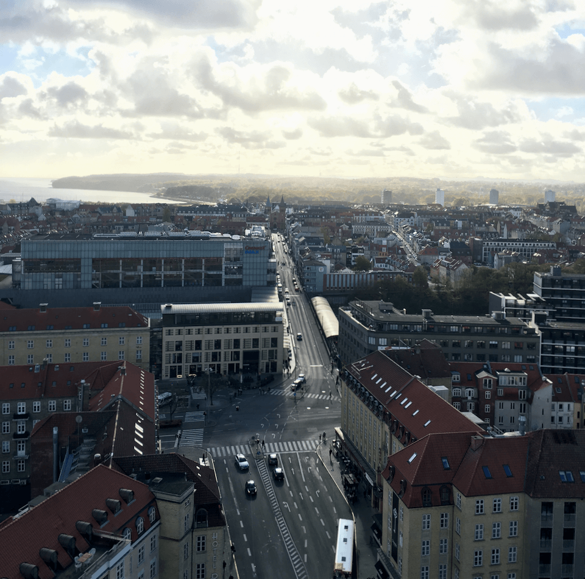
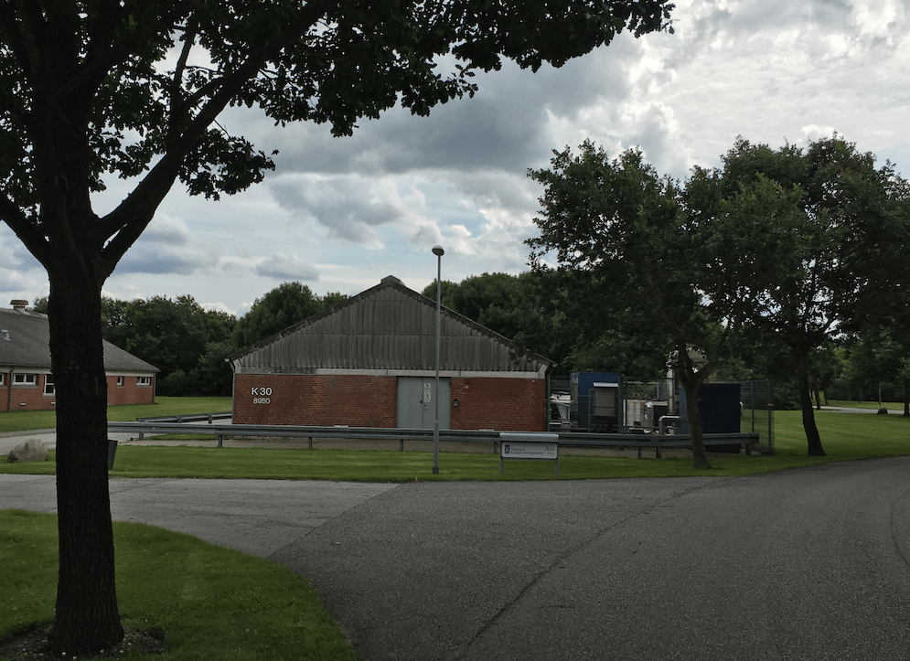
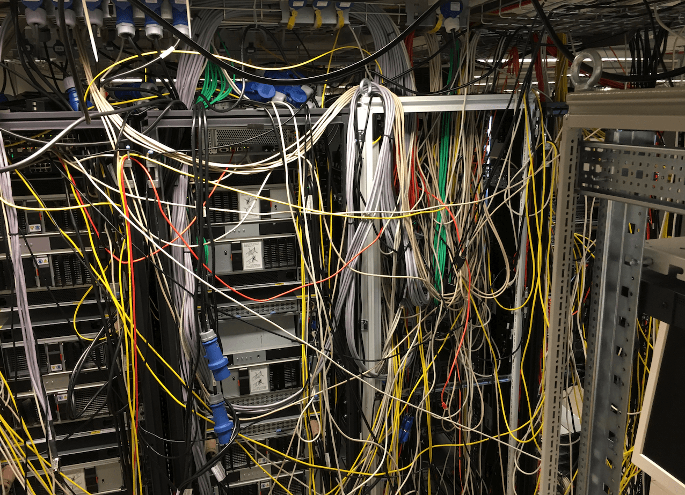

+++
author = "Aravindh Sampathkumar"
categories = ["Computers"]
date = 2024-01-15T12:00:00Z
summary = "From the trenches of High Performance Computing clusters"
tags = ["Sysadmin", "SRE", "performance"]
title = "Role of a sysadmin"
type = "post"
images = ["img/lean_fast.jpg"]
draft = true
+++

## Duties
A sysadmin is responsible for upkeep, configuration, and reliable operation of systems and services.

## Accidental sysadmin
I was living in Raleigh, North Carolina, working as a Performance Engineer when I decided to move to Denmark to be with my then girlfriend, now wife, and start a family. Moving to another continent entails a lot of change and looking for a job is no different. I learned soon that finding a job as a Performance Engineer in Europe is not as straightforward as it would be in the US. I instead ventured on a job search based on the skills I have. Voila, I found that I could be a starter sysadmin - I have administered systems before, and turns out there is a lot of commonality between "understanding the system enough to engineer its performance" and "administering a system". 

After some Skype interviews, and arduous work permit paper work, here I am in Aarhus, Denmark.

## Orientation
Orientation or transition is very important for a sysadmin is very important, particularly so for someone who is in those shoes anew. Here are some observations I made on the first day in the job :

-   My predecessor had left the job a few months before my arrival
    
-   A barn is re-purposed as a capable data center
    
-   There is no documentation whatsoever about inventory or purpose of the machines
    
-   The HPC batch scheduler system currently in use (PBS) is causing a lot of pain
    
-   All of my colleagues are bioinformaticians/researchers except one who had been a sysadmin early in his career
    
-   All of my colleagues are nice to me and are rooting for me to do a great job
    
-   I have a lot of room to do good and learn
    

So, I buckled up and started the ride.

