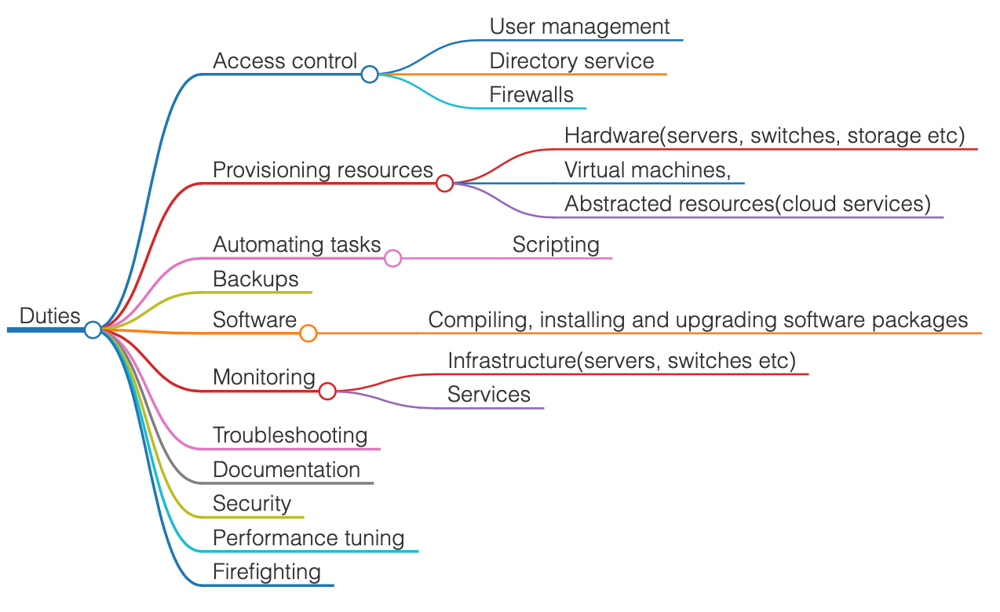

+++
author = "Aravindh Sampathkumar"
categories = ["Computers"]
date = 2024-01-15T12:00:00Z
summary = "From the trenches of High Performance Computing clusters"
tags = ["Sysadmin", "SRE", "performance"]
title = “Role of a sysadmin"
type = "post"
images = ["img/lean_fast.jpg"]
draft = true
+++

## Duties
A sysadmin is responsible for upkeep, configuration, and reliable operation of systems and services.

